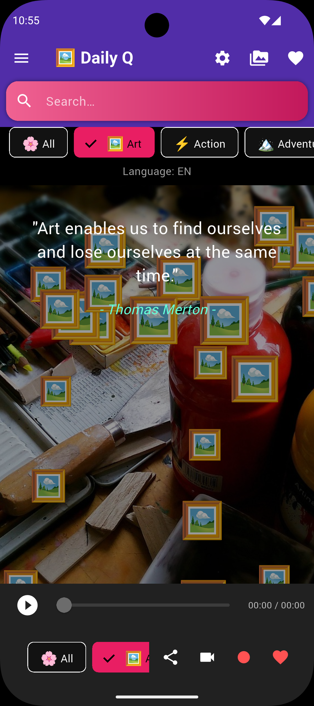
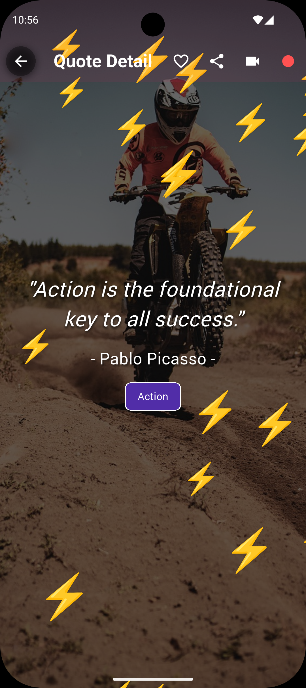

# Quotes_App

A Flutter app for daily inspirational quotes with Firebase integration.  
Users can view, favorite, and share quotes. This app supports multiple platforms including Android, iOS, and Web.

---

## **Features**

- Daily quote display
- Favorite quotes
- Quote history
- Author-wise quotes
- Category-based quotes
- Share quotes as image
- Home screen widget support (Android)
- Scheduled daily quote updates
- Firebase Cloud Firestore backend
- Fully open-source and free for commercial use

---

## App Screenshots

### Home Screen


### Quote Detail Screen


---

## **Getting Started**

### **Prerequisites**

- Flutter SDK (version 3.13.0 or higher recommended)
- Android Studio / Xcode / VS Code
- Git

---

### **Clone the repository**

```bash
git clone https://github.com/Dhanavath-Bhaskar/Quotes_App.git
cd Quotes_App
